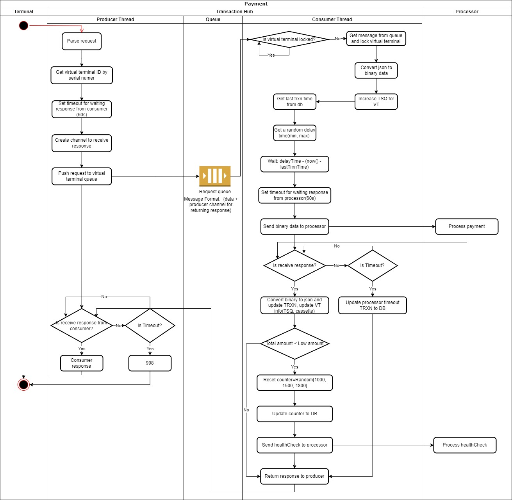

# FRS for Transaction Hub
## Version
| Date       | Version | Author | Description     |
|------------|---------|--------|-----------------|
| 18-10-2023 | 1.0     | DatDT  | Initial Version |
## Abbreviation
- Physical Terminal: PT
- Virtual Terminal: VT
- Working Key: WK
- Serial Number: SN
- Average time of success transaction: ATT
- Min time delay between transactions: MinTDL
- Max time delay between transactions: MaxTDL
- Timeout for request send from physical terminal to virtual terminal: PTTO
- Timeout for request send from virtual terminal to processor: VTTO
- Transaction: TRXN
## I. Overview
- Language: Golang
- Database: MS-SQL
- Total estimation time: 142h
## II. Transaction Hub APIs
- APIs for PT (Post API.docx)
  - Get working key
  - Request payment
  - Check transaction
  - Balance Inquiry
## III. Transaction Hub Modules
### 1. API
#### 1.1. Get working key
- Draft flow: Serial number => Physical terminal ID => Virtual terminal ID => Get working key from DB
  - if working key == NULL: Call processor to get working key for this virtual terminal => Update working key to DB => return working key
  - else: return working key
- Diagram:
  
- Estimate:
  - Implement: 10h
  - Unit test: 4h
  - Total: 14h
#### 1.2. Request payment
- Draft flow: 
  - Producer thread: Push request to queue, create a timer(60) => Wait for response from consumer or if timer active => return 998
  - Queue: Receive request
  - Consumer thread: Check VT is locked
    - Yes: Do nothing, sleep(1s) to check VT lock state again
    - No:
      - Read request and lock VT 
      - Convert request json to binary
      - Calculate time to wait: rand(min, max) - (now() - lastTrxnTime of VT)
      - Create transaction record (state = create) before send request to processor
      - Create a timer (processor timeout config) for response from processor
      - Send request to processor
        - If timeout: Update transaction state=fail because of processor timeout
        - Send response transaction fail to producer
      - Receive response from processor
      - Parse response and update transaction state
      - Convert binary to json
      - Send response to producer
- Diagram:
  
- Estimate:
  - Research for producer and consumer mechanism: 7h
  - Implement producer logic: 7h
  - Implement consumer logic: 14h
  - Unit test: 7h
  - Total: 35h
#### 1.3. Transaction check
- Draft flow: Parse request => Query DB to check TRXN info and TRXN status => Return response
- Diagram:
  
- Estimate:
  - Implement: 7h
  - Unit test: 4h
  - Total: 11h
#### 1.4. Balance Inquiry
- Draft flow: Parse request => Same logic to payment request (Call to processor and change some fields) => Return response
- Diagram: (same to payment diagram)
- Estimate:
  - Implement: 7h
  - Unit test: 4h
  - Total: 11h
### 2. Schedule Jobs
#### 2.1. Get working key (interval=VT.Working key exchange interval)
- Draft flow: Send request to processor to get working key for virtual terminal => Update working key to DB
- Diagram:
  
- Estimate:
  - Implement: 7h
  - Unit test: 4h
  - Total: 11h
#### 2.2. Cash Position (interval=VT.HealCheck interval)
- Draft flow: Check VT balance < VT.LowAmount => Send request to processor to do Cash Position (random [1000, 1500, 1800])
=> Check response => Success => Update VT Cassette infomation
- Diagram:
  
- Estimate:
  - Implement: 7h
  - Unit test: 4h
  - Total: 11h
### 3. Database package
- Create package to query and update virtual terminal,physical terminal, transaction, lock,... to MSSQL
- Create interface for main package to call
- Estimate:
  - Implement: 14h
  - Unit test: 7h
  - Total: 21h
### 4. Processor communication package
- Create package to map and parse processor data (json <=> binary)
- Create interface for main package to call
- Estimate:
  - Research (read processor document and code example): 7h
  - Implement: 14h
  - Unit test: 7h
  - Total: 28h

